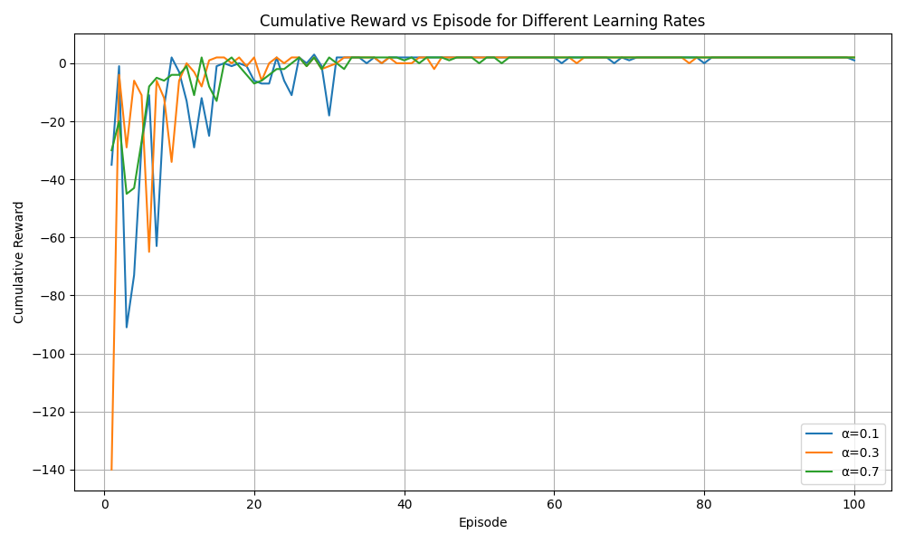

# Q-Learning Application in a Grid World Environment

This repository contains a Python implementation of a Q-learning agent designed to solve a 5x5 Grid World environment. The environment features obstacles and a special jump dynamic. The agent learns an optimal policy by interacting with the environment and updating its Q-table based on received rewards.

## Project Structure

-   `grid_q_learning.py`: The main Python script containing the `GridWorld` environment definition, the Q-learning agent implementation, experiment runner, and plotting functions.
-   `results/`: This directory will be created automatically upon running the script and will store all the generated plots.
-   `README.md`: This file provides an overview of the project and instructions.

## Features

-   **Grid World Environment:** A 5x5 grid with:
    -   A defined start position.
    -   A terminal (goal) position with a positive reward.
    -   Obstacles that prevent movement.
    -   A "special jump" cell that teleports the agent to another location with an additional reward, ending the episode.
    -   Standard actions (Up, Down, Left, Right).
-   **Q-Learning Agent:**
    -   Tabular Q-learning implementation.
    -   Epsilon-greedy exploration strategy with decay.
    -   Training for a specified number of episodes with an early stopping condition based on average cumulative reward.
-   **Visualization:**
    -   **Cumulative Reward vs. Episode:** Plots showing the learning progress for different learning rates.
    -   **Epsilon Decay Schedule:** Illustrates how the exploration rate decreases over episodes.
    -   **Average Absolute TD Error:** Shows the convergence of the Q-values.
    -   **Average Cumulative Reward Bar Chart:** Compares the performance of different learning rates.
    -   **Q-Table Heatmaps:** Visual representation of the learned state values at specific episodes.
    -   **Greedy Policy Maps:** Shows the optimal action (greedy policy) for each state at specific episodes.

## How to Run the Code

1.  **Save the code:** Save the provided Python code as `grid_q_learning.py` in a directory of your choice.

2.  **Install Required Libraries:**
    The code relies on the following Python libraries. If you don't have them installed, you can install them using `pip`:

    ```bash
    pip install numpy matplotlib
    ```

3.  **Run the Script:**
    Open your terminal or command prompt, navigate to the directory where you saved `grid_q_learning.py`, and run the script using the Python interpreter:

    ```bash
    python grid_q_learning.py
    ```

    The script will print progress messages to the console. It will also create a `results/` directory in the same location as your script and save all the generated plots inside it.

## Generated Plots

Upon successful execution, the `results/` directory will contain several `.png` image files. Here's a description of the plots you will find:

-   **`cumulative_reward.png`**:
    This plot shows the cumulative reward obtained by the agent in each episode for different learning rates (α). It helps visualize the learning curve and convergence speed.

    

-   **`epsilon_decay.png`**:
    This plot displays the decay of the epsilon ($\epsilon$) value over episodes. Epsilon controls the balance between exploration and exploitation.

    

-   **`average_td_error.png`**:
    This plot illustrates the average absolute Temporal Difference (TD) error per episode for different learning rates. A decreasing TD error indicates that the Q-values are converging.

    

-   **`average_final_reward_bar_chart.png`**:
    This bar chart compares the average cumulative reward obtained by the agent over the last 30 episodes for each learning rate.

    

-   **Q-Table Heatmaps and Policy Maps (Examples):**
    For each learning rate, the script generates snapshots of the Q-table heatmaps and greedy policy maps at specific episodes (e.g., Episode 10 and Episode 50, and the final episode). These visualizations show how the agent's understanding of the environment evolves.

    -   **Q-Table Heatmap for α = 0.1, Episode 10:**
        
    -   **Greedy Policy Map for α = 0.1, Episode 10:**
        

    *(Similar plots will be generated for other learning rates and episodes)*

## Contributions

Feel free to fork the repository, experiment with different parameters, and contribute improvements.